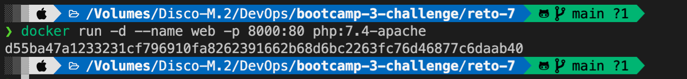
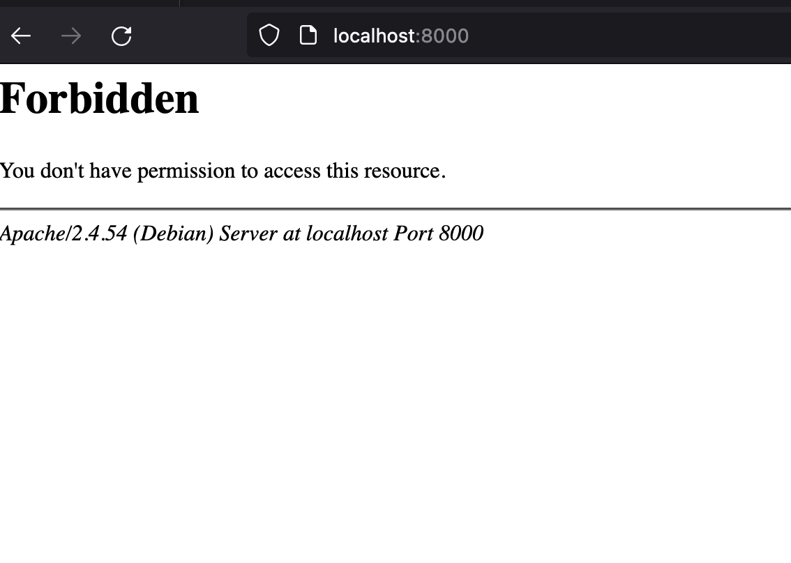
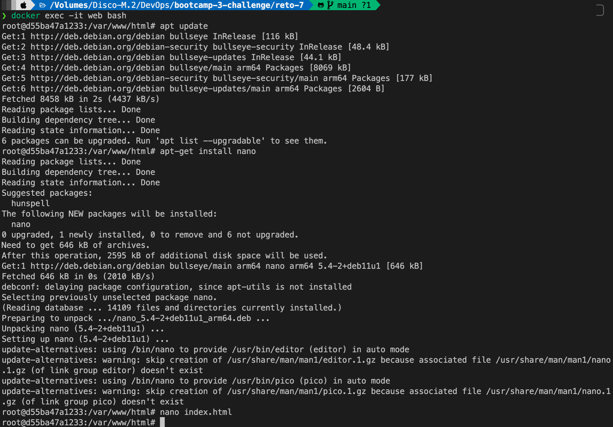
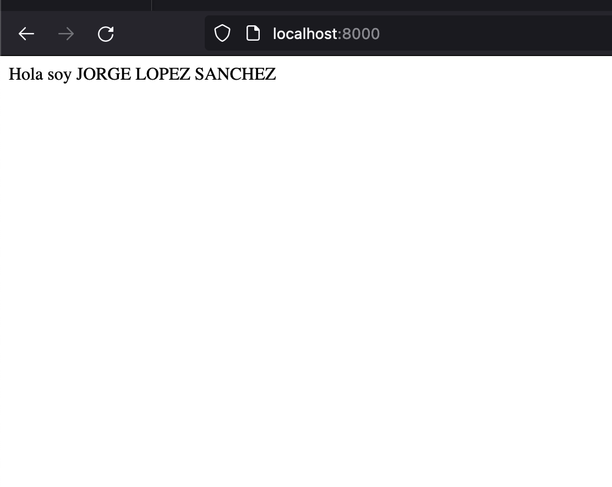
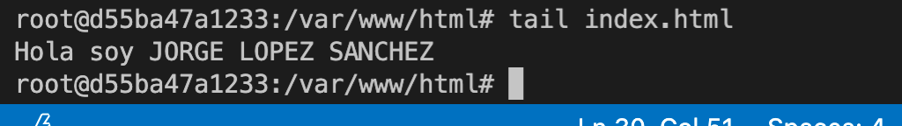
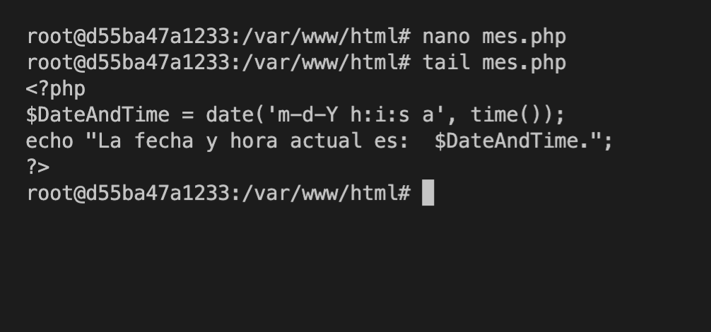
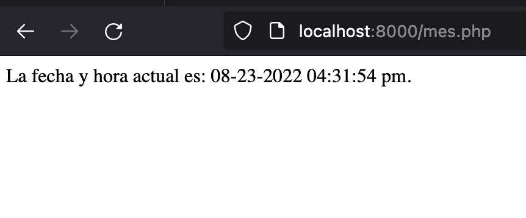
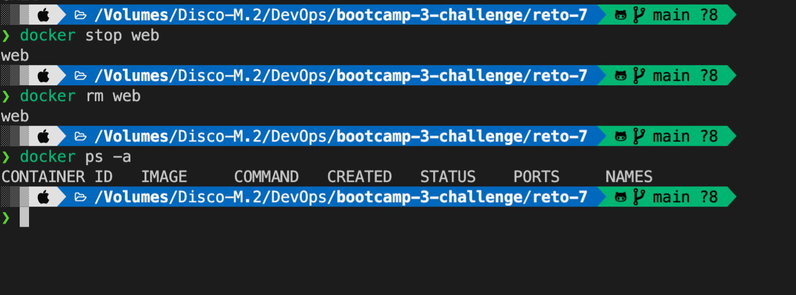

# Solucion a reto 7

## 1.- Arrancar un contenedor que ejecute la imagen php:7.4-apache, llamado web, por el puerto 8000.

- Observando en el dockerhub corespondiente a la imagen y tag indicado obsevamos que la imagen expone el puerto 80, entonces queda el comando de la siguiente forma.

```
docker run -d --name web -p 8000:80 php:7.4-apache
```




## 2.- Colocar en el directorio raíz del contenedor un archivo index.html que contenga 'HOLA SOY XXXXX' (nombre y apellidos).

- Ejecute los siguientes comandos para instalar el editor nano y crear el archivo index.html

```
docker exec -it web bash
apt update
apt-get install nano
nano index.html
```



- Dentro de este archivo escribo la siguiente linea

> Hola soy JORGE LOPEZ SANCHEZ



- Compruebo el contenido del archivo

```
tail index.html
```



## 2.- Colocar en el mismo directorio otro archivo llamado llamado mes.php que muestre el mes actual, y ver la salida del script en el navegador.

- Creo el archivo 'mes.php'

- COn el siguiente contenido

```php
<?php
$DateAndTime = date('m-d-Y h:i:s a', time());
echo "La fecha y hora actual es:  $DateAndTime.";
?>
```




## Borrar el contenedor.

```
docker stop web
docker rm web
```


