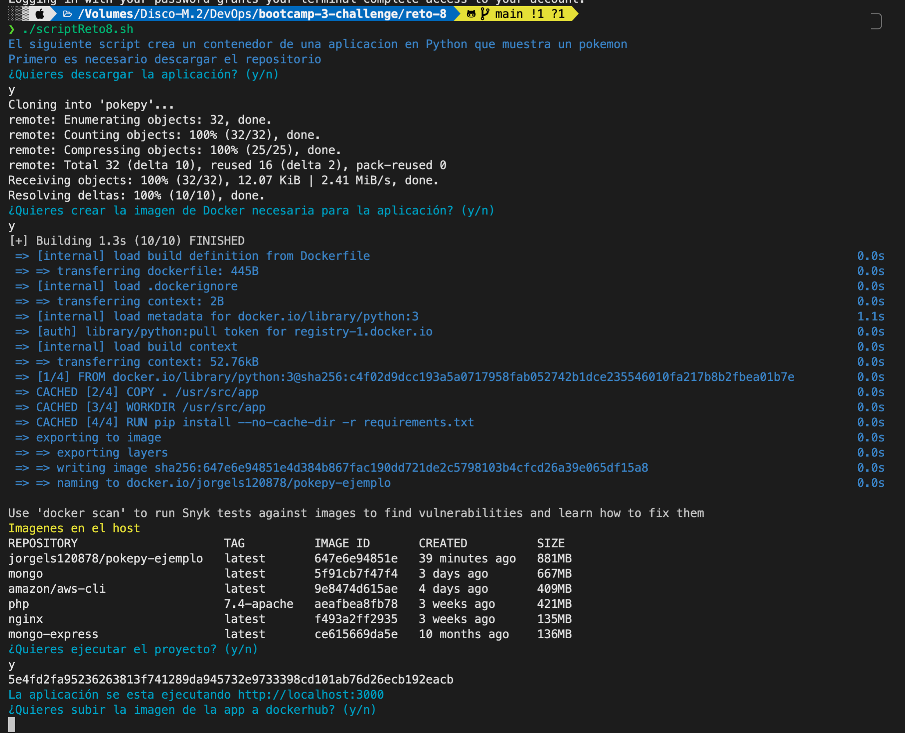
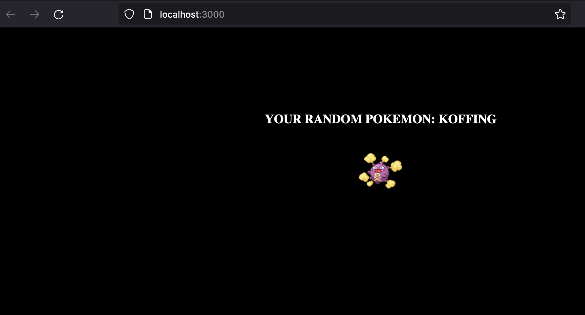

# Solucion a reto 8

```bash
echo -e "\033[0;34mEl siguiente script crea un contenedor de una aplicacion en Python que muestra un pokemon"
echo "Primero es necesario descargar el repositorio"
echo -e "\033[0;36m¿Quieres descargar la aplicación? (y/n)\033[0;37m"
read runProcess
if [[ $runProcess == "y" || $runProcess == "Y" ]]
then
    git clone https://github.com/GeorgeCodde/pokepy.git
    cd pokepy
    rm -rf .git

    echo -e "\033[0;36m¿Quieres crear la imagen de Docker necesaria para la aplicación? (y/n)\033[0;37m"
    read createImage
    if [[ $createImage == "y" || $createImage == "Y" ]]
    then
        docker build -t jorgels120878/pokepy-ejemplo .
        cd ..
        rm -rf pokepy
        echo -e "\033[0;33mImagenes en el host\033[0;37m"
        docker images
        echo -e "\033[0;36m¿Quieres ejecutar el proyecto? (y/n)\033[0;37m"
        read runApp
        if [[ $runApp == "y" || $runApp == "Y" ]]
        then
            docker run -d --name pokepy -p 3000:5000 jorgels120878/pokepy-ejemplo
            echo -e "\033[0;36mLa aplicación se esta ejecutando http://localhost:3000 \033[0;37m"
            echo -e "\033[0;36m¿Quieres subir la imagen de la app a dockerhub? (y/n)\033[0;37m"
            read loadApp
            if [[ $loadApp == "y" || $loadApp == "Y" ]]
            then
                docker login
                docker tag jorgels120878/pokepy-ejemplo jorgels120878/pokepy-ejemplo:v1.0
                docker push jorgels120878/pokepy-ejemplo:v1.0
                echo -e "\033[0;36mLa imagen de la aplicacion esta en https://hub.docker.com/repository/docker/jorgels120878/pokepy-ejemplo \033[0;37m"
            fi
            docker stop pokepy
            docker rm pokepy
            echo -e "\033[0;31m--Contenedor de la aplicación eliminado--\033[0;37m"
            echo -e "\033[0;33mLista de contenedores\033[0;37m"
            docker ps -a
            docker image rm jorgels120878/pokepy-ejemplo
            docker image rm jorgels120878/pokepy-ejemplo:v1.0
            echo -e "\033[0;31m--Imagen local eliminada--\033[0;37m"
            echo -e "\033[0;33mLista de imagenes\033[0;37m"
            docker images

        fi
        docker image rm jorgels120878/pokepy-ejemplo
        echo -e "\033[0;31m--Imagen local eliminada--\033[0;37m"
        echo -e "\033[0;33mLista de imagenes\033[0;37m"
        docker images
    fi
fi
```

## Ejecución



