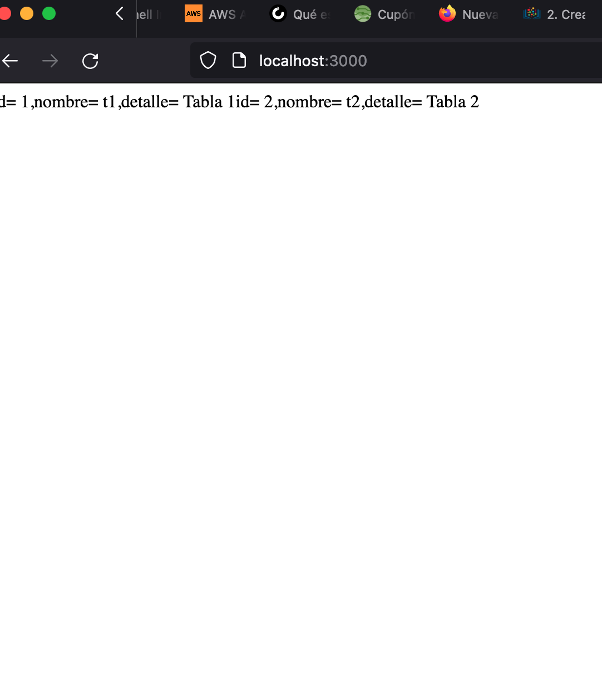

# Solucion a reto 9

- A continuación el [archivo](https://github.com/GeorgeCodde/solucion-bootcamp-3-chalenge/blob/main/reto-9/docker-compose.yml) yml donde se muestra la creacion de los contenedores y principalmente como se realizo la creación del contenedor con dependencia de que primero se creara la base de datos.

- Otro de los puntos importantes fue la configuracion de las variables de entorno adecuadas a lo que necesitaba la aplicación en python.

```yml
ersion: "3.7"
services:
  dbpostgres:
    container_name: dbpostgres
    build: ./postgres/
    restart: always
    environment:
      POSTGRES_USER: test
      POSTGRES_PASSWORD: test
      POSTGRES_DB: test
    networks:
      - postgres-net

  backend:
    container_name: myapp
    build: ./myapp/
    depends_on:
      - dbpostgres
    restart: always
    environment:
      POSTGRES_USER: test
      POSTGRES_PASSWORD: test
      POSTGRES_DB: myappdb
      POSTGRES_HOST: dbpostgres
      POSTGRES_PORT: 5432
    ports:
      - "3000:5000"
    networks:
      - postgres-net

networks:
  postgres-net:
    driver: bridge
```

- Realice mejoras en el [dockerfile](https://github.com/GeorgeCodde/solucion-bootcamp-3-chalenge/blob/main/reto-9/myapp/Dockerfile) de la aplicacion y quedo como se muestra acontinuación

```dockerfile
FROM python:3
WORKDIR /usr/src/app
COPY requirements.txt ./
RUN apt-get -y update
RUN pip install --no-cache-dir -r requirements.txt
COPY . .
EXPOSE 5000
CMD ["python3","./myapp.py"]
```

- Agrego prueba de que la aplicación esta funcionando


